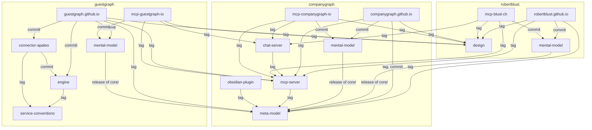

# Repositories

Three organizations, one family. `robertblust` holds the person and the shared machinery, `guestgraph` the guest identity graph, `companygraph` the meta-model for operating a company. Every repository below vendors this repository's `conventions/` at a pinned release and opens its `AGENTS.md` with the same block; `CLAUDE.md` is the same four-line vendor adapter everywhere. The `Title` column is the member's README title in full, the string its first line carries after `# `, and a tripwire in `conventions-check` holds each member to its own row.

| Repository | Title | Purpose | Default branch | Local path |
| --- | --- | --- | --- | --- |
| robertblust/conventions | Robert Blust — Conventions | how the family writes and works, vendored by every member | main | ~/git/robertblust/conventions |
| robertblust/design | Robert Blust — Design | the design system shared by the three sites: tokens, chrome, page checks | main | ~/git/robertblust/design |
| robertblust/robertblust.github.io | blust.ch | blust.ch, the profile page and its talks | main | ~/git/robertblust/robertblust.github.io |
| robertblust/mental-model | Robert Blust — Mental Model | Robert Blust described in CompanyGraph, the reference instance | main | ~/git/robertblust/mental-model |
| robertblust/field-notes | Robert Blust — Field Notes | problems that took real work to understand, one file each | main | ~/git/robertblust/field-notes |
| robertblust/mcp-blust-ch | mcp.blust.ch | mcp.blust.ch, the reference instance served over MCP from a pinned commit of the model | main | ~/git/robertblust/mcp-blust-ch |
| guestgraph/guestgraph.github.io | guestgraph.io | guestgraph.io, the landing page, the model pages drawn from GuestGraph's instance, the API and the intro talk | main | ~/git/guestgraph/guestgraph.github.io |
| guestgraph/engine | GuestGraph — Engine | identity resolution, guest graph and REST API, the open core | main | ~/git/guestgraph/engine |
| guestgraph/connector-apaleo | GuestGraph — Apaleo Connector | the Apaleo connector: reservations and bookings into the guest graph, a client of the engine's API | main | ~/git/guestgraph/connector-apaleo |
| guestgraph/service-conventions | GuestGraph — Service Conventions | the code-level rules of the guestgraph services: one list, one directory per stack, vendored by every service at a pinned release | main | ~/git/guestgraph/service-conventions |
| guestgraph/mental-model | GuestGraph — Mental Model | GuestGraph described in CompanyGraph's vocabulary, the third instance | main | ~/git/guestgraph/mental-model |
| guestgraph/mcp-guestgraph-io | mcp.guestgraph.io | mcp.guestgraph.io, GuestGraph's own instance served over MCP from a pinned commit of the model, and the chat over it | main | ~/git/guestgraph/mcp-guestgraph-io |
| guestgraph/.github | GuestGraph — Organization | the organization profile GitHub shows, and nothing else | main | ~/git/guestgraph/.github |
| companygraph/companygraph.github.io | companygraph.io | companygraph.io, the landing page, the model and example pages, the intro talk | main | ~/git/companygraph/companygraph.github.io |
| companygraph/meta-model | CompanyGraph — Meta Model | the meta-model: core vocabulary, packs and the conventions that make a graph of Markdown checkable | main | ~/git/companygraph/meta-model |
| companygraph/mental-model | CompanyGraph — Mental Model | CompanyGraph described in the vocabulary it publishes, the second instance | main | ~/git/companygraph/mental-model |
| companygraph/mcp-server | CompanyGraph — MCP Server | a read-only MCP server for any instance: the model's facts, queryable by an agent from one pinned commit | main | ~/git/companygraph/mcp-server |
| companygraph/mcp-companygraph-io | mcp.companygraph.io | mcp.companygraph.io, CompanyGraph's own instance served over MCP from a pinned commit of the model | main | ~/git/companygraph/mcp-companygraph-io |
| companygraph/chat-server | CompanyGraph — Chat Server | a chat over any instance's MCP host: a visitor's question answered from what the host's tools say, on a site's page, holding no model of its own | main | ~/git/companygraph/chat-server |
| companygraph/obsidian-plugin | CompanyGraph — Obsidian Plugin | an Obsidian plugin for any instance: the meta-model's checks while a file is edited, and completion for what its schemas declare | main | ~/git/companygraph/obsidian-plugin |
| companygraph/.github | CompanyGraph — Organization | the organization profile GitHub shows, and nothing else | main | ~/git/companygraph/.github |

## The list is the scope

What is listed here is the family; what is not listed is outside it. An agent working in a member reads, links and reasons within this list, and does not reach for a repository, a directory or a file outside it on its own — not for context, not for an example, not because it sits beside a member on the same disk. When a task needs something outside the list, the task says so, names it, and names the one purpose it serves; that reference belongs to that task and does not bring the thing into the family.

## What pins what

The three sites pin `robertblust/design` by tag in `package.json`, and `npm run design` writes the fenced copies. blust.ch pins `robertblust/mental-model`, companygraph.io pins `companygraph/meta-model` and `companygraph/mental-model`, and guestgraph.io pins `guestgraph/mental-model`, each by commit in `source.json`, and each builds its model pages from that commit. All three sites also depend on `companygraph/meta-model` by tag in `package.json` for the instance parser, and take `companygraph/mcp-server` by tag there too. guestgraph.io pins `guestgraph/engine` and `guestgraph/connector-apaleo` by commit in `api-sources.json`, and builds its API pages from the OpenAPI specification each commit holds. The three instances, `robertblust/mental-model`, `companygraph/mental-model` and `guestgraph/mental-model`, each vendor meta-model's `core/` at the release that `core.version` names in their own `.companygraph/manifest.json`. The engine and the connector each vendor `guestgraph/service-conventions` at the tag in `service-conventions.json`, and the connector pins the contracts it implements, which live under the engine's `specs/`, by commit in `src/main/resources/api/sources.json`. The MCP server depends on `companygraph/meta-model` by tag in `package.json` for the same parser; each of its three deployments pins an instance by commit in `source.json`, mcp.blust.ch `robertblust/mental-model`, mcp.companygraph.io `companygraph/mental-model` and mcp.guestgraph.io `guestgraph/mental-model`, and the server and `robertblust/design` by tag in `package.json`, and builds and deploys with the parts the server ships under `deploy/`. The chat server takes `companygraph/mcp-server` by tag in `package.json` as a development dependency and is a client of whichever MCP host a deployment names, and each of the same three deployments pins it and `robertblust/design` by tag in `chat/package.json` and deploys it beside the host from the parts it ships under `deploy/`, so a re-pin of the host is a change the chat sees without one of its own. The Obsidian plugin depends on `companygraph/meta-model` by tag in `package.json` for the parser and the checks, and bundles them into what it releases. Every member pins this repository by tag in `conventions.json`.

The same pins, drawn: an arrow runs from the member that pins to the repository it pins, and its label says how. Each node is named as its repository is, under its organization.

Every member also pins `robertblust/conventions`, and drawn that would be an arrow from every node to one more; it is left out, and with it `robertblust/field-notes`, `guestgraph/.github` and `companygraph/.github`, which pin nothing else. A test holds the drawing to the table: each repository listed above is a node here or is named in this paragraph, so a member added to the table and not to the drawing turns the suite red. It does not check the arrows; the paragraph above is what they draw, and an edit to one is an edit to both.

A pin is an editorial line, moved on purpose. Which release each member is on is read from the pin, never from this file, so this file does not repeat versions.

## Re-syncing after a release

In this order, one pull request each: design, then the three sites, then the three instances and meta-model, then service-conventions, then the engine, then the connector, then the MCP server, the chat server and the three deployments, then the Obsidian plugin, then field-notes, then the two `.github` repositories. Design first because a site's suite runs design's checks; the models before the engine because the sites' model pages are built from them; service-conventions before the engine and the connector because both vendor it; the connector after the engine because it is a client of the engine's API and its specification lives there; the MCP server after the models because it parses them, the chat server beside it because it is a client of the server's hosts and the same deployments pin both, the deployments after both because each pins a release of each, and the Obsidian plugin after the models for the server's reason, since it parses them with the same package. Nothing here opens those pull requests for you.
